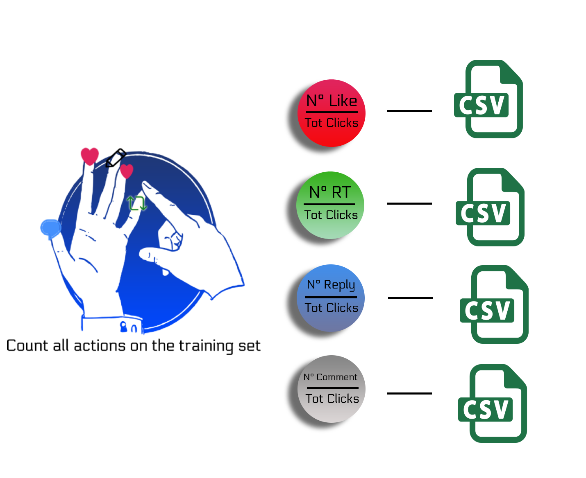

# Execute the code

This repository includes the code to replicate the two submissions of the POLINKS Team.

The first one, called *Optimized Constant*  achieve the sixth place in the final leaderboard. An overview of the model is represented in the following image:



## Optimized Constant

This algorithm was created to optimize the result and to find the best constant for the two metrics of the challenge.

Install the requirements:

```bash
pip install -r Constant/requirements.txt	
```


To run the algorithm just put the files *val.tsv* and *competition_test.tsv* in the same folder of the script and run:

```bash
python Constant/constant_solution.py --trainingpath mypath/training.tsv --validationpath mypath/val.tsv --testpath mypath/test.tsv
```

If you want to compute again the value of th CTR use the following option:

```bash
python Constant/constant_solution.py --computectr
```


## Gradient Boosting

Due to the dataset dimension the code is divided in different steps, covering the generation and the training of the dataset.

Below are listed the steps to reproduce the solution.

1. Install the requirements:

   ```bash
   pip install -r GradientBoosting/requirements.txt	
   ```

   

2. Check if all the files (*training.tsv*, *val.tsv*, *competition_test.tsv*) are in the directory of the script or define the correct path with the parameters:

   ```bash
   python GradientBoosting/full_solution.py --trainingpath mypath/training.tsv --validationpath mypath/val.tsv
   ```

   

3. Run the script that execute all the operations

   ```bash
   python GradientBoosting/full_solution.py
   ```

### Model overview

An overall idea of the model is outlined in the image below:


### Logical steps

The script *full_solution.py* will perform the following logical steps:

1. Generate the **.csv** with the features about the *engaging users*
2. Generate the **.csv** with the features related to the *author of the tweet*
3. Generate the **.csv** considering all the languages spoken by each user in the dataset. A language is considered in this list if the user has previously interacted with a tweet written in that specific language.
4. Generate 4 **.csv** files, one for each type of engagement, that collects, for each user, all the authors it has engaged with.
5. Generate the training for the **Gradient Boosting** model: the full dataset, integrated with the features generated previously has to be written on disk because for the training is used the [Xgboost external memory](https://xgboost.readthedocs.io/en/latest/tutorials/external_memory.html) implementation, due to the large size of the dataset.
6. Train the four models and write them on file. 
7. Generate the submission for the validation/test file