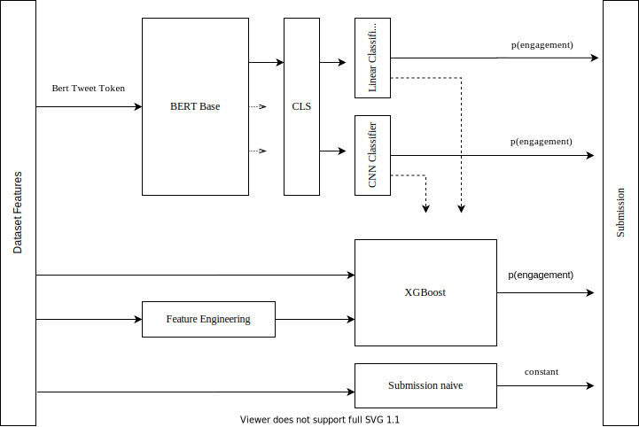

# BERT For Sequence Classification with Linear Classifier
# BERT For Sequence Classification with CNN Classifier

[Recsys 2020 Twitter Challenge](https://recsys-twitter.com/).

## Draft Pipeline



## Requirements

```
boto3==1.12.39
botocore==1.15.39
certifi==2020.4.5.1
chardet==3.0.4
click==7.1.1
dataclasses==0.6
docutils==0.15.2
filelock==3.0.12
idna==2.9
jmespath==0.9.5
joblib==0.14.1
numpy==1.18.2
pandas==1.0.3
python-dateutil==2.8.1
pytz==2019.3
regex==2020.4.4
requests==2.23.0
s3transfer==0.3.3
sacremoses==0.0.41
scikit-learn==0.22.2.post1
scipy==1.4.1
sentencepiece==0.1.85
six==1.14.0
sklearn==0.0
tokenizers==0.5.2
torch==1.4.0
tqdm==4.45.0
transformers==2.8.0
urllib3==1.25.8

```
NB: pip freeze results at the end of the challenge. Some packages may not be necessary.

## Usage

### Training
```
python3 bert_training.py 
  --data <path to data>
  --tokcolumn <text token column name[Text_tokens]> 
  --epochs <epochs> 
  --batch <batch size> 
  --workers <workers> 
  --testsplit <validation % over whole dataset>

```

### Testing
```
python3 bert_test.py 
  --data <path to data>
  --tokcolumn <text token column name [Text_tokens]> 
  --tweetidcolumn <text token column name [Tweet_id]>
  --usercolumn <user column name [User_id_engaging]>
  --batch <batch size> 
  --workers <workers> 

```

## Acknowledgements
Computational resources were provided by HPC@POLITO, a project of Academic Computing within the Department of Control and Computer Engineering at the Politecnico di Torino (http://www.hpc.polito.it)

https://github.com/sugi-chan/custom_bert_pipeline/blob/master/bert_pipeline.ipynb

https://huggingface.co/transformers/
